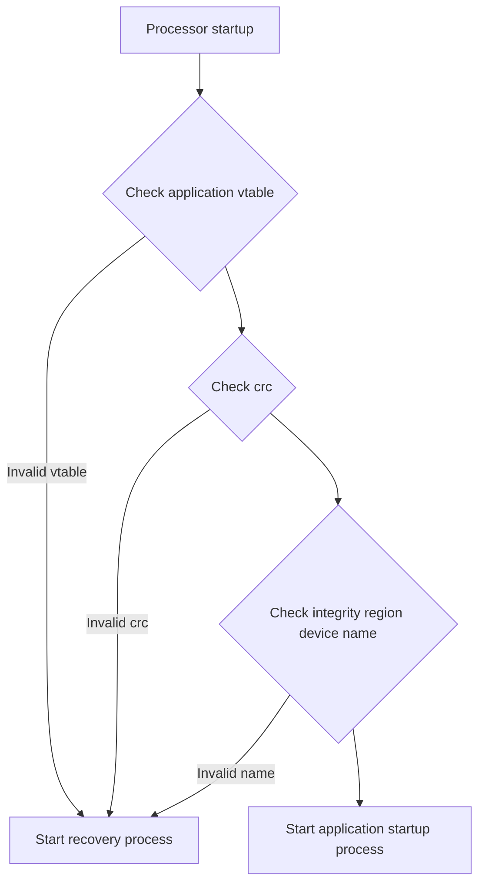
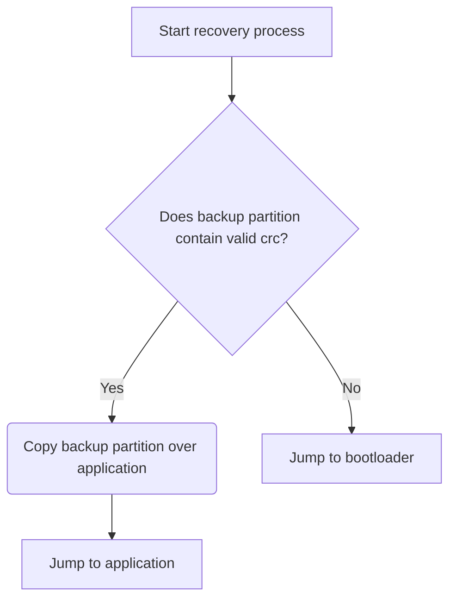
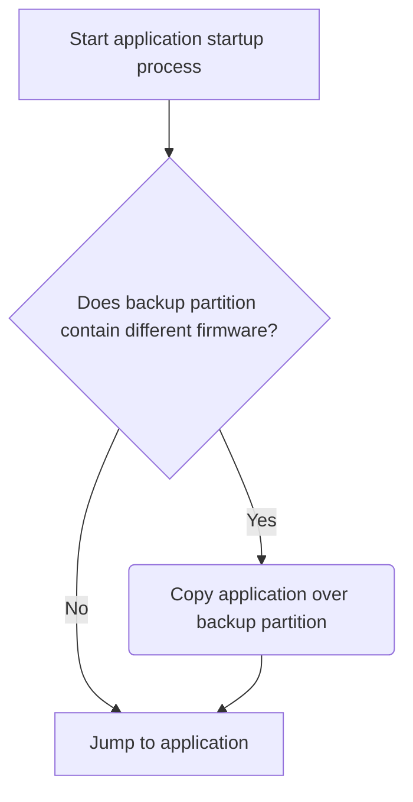

# MODULES STARTUP
The STM32 modules use the STM32 inbuilt bootloader which allows for firmware updates via USB through the DFU protocol. In the scenario that a module's power is removed while it is in the process of updating, there is a chance that the firmware loaded on the microcontroller will be invalid. In this scenario, there is no way for the module to reach the bootloader again, and thus it will be "bricked" forever, unable to ever boot back to the bootloader.

The code in this folder is intended to provide a failsafe system to prevent this scenario. The first chunk of memory in the micocontroller is occupied by the __startup application__, which is responsible for verifying the integrity of the __application firmware__. The overall layout of the microcontroller memory is configurable for each microcontroller. At compile and link time, a maximum size `APP_SIZE` must be specified for the firmware image, and must be provided to the startup application. This is not the size of a specific build of the firmware, but rather the maximum allotted size it may occupy. 

Given an application size of `APP_SIZE` bytes, the layout of flash memory is as follows:

| Offset from flash start | Length   | Description |
| ----------------------- | -------- | ----------- |
| 0                       | 0x8000   | Startup app |
| 0x8000                  | APP_SIZE | Application firmware |
| 0x8000 + APP_SIZE       | APP_SIZE | Application backup partition |

The main application firmware image is expected to be linked to start 32K into the flash region, at address 0x08008000. The layout must be as follows:

| Offset from application start | Description |
| ----------------------------- | ----------- |
| 0x0000                        | Vector table |
| 0x0200                        | Integrity Info table |
| 0x0400                        | Remainder of application |

The Integrity Info Table contains information required by the startup module to confirm that the application firmware is correct:

| Length (bytes)  | Description |
| ------------- | ------------- |
| 4             | Firmware CRC (calculated with CRC32 Ethernet polynomial, initial value 0xFFFFFFFF)  |
| 4             | Firmware length in bytes, counting from 0x08008400  |
| 4             | Address where firmware length counting begins. Should always be 0x08008400 |
| N/A           | Null-terminated string containing the name of the module this firmware is for. |

The overall goal of the startup app is to prevent a failed firmware update from resulting in a permanently bricked system. The overall process is as follows:

The "recovery process" will attempt to load an old version of firmware, or as a last resort jump to the bootloader:

The Application Startup Process will check if the application is different than the one loaded to the backup partition; if this is the case, it will overwrite the backup partition before starting the application.

