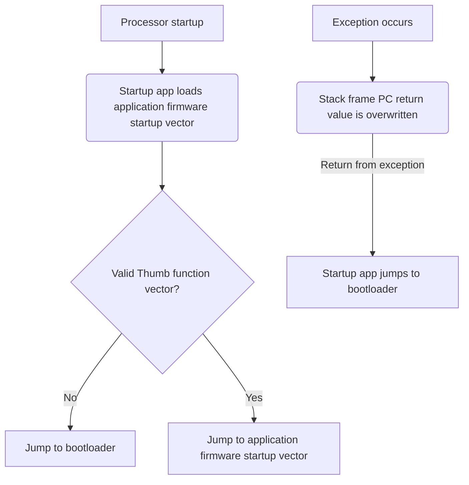

# MODULES STARTUP
The STM32 modules use the STM32 inbuilt bootloader which allows for firmware updates via USB through the DFU protocol. In the scenario that a module's power is removed while it is in the process of updating, there is a chance that the firmware loaded on the microcontroller will be invalid. In this scenario, there is no way for the module to reach the bootloader again, and thus it will be "bricked" forever, unable to ever boot back to the bootloader.

The code in this folder is intended to provide a failsafe system to prevent this scenario. The first sector of memory in the micocontroller is occupied by the startup assembly file. The startup application will start the application firmware as long as it appears valid (based on examining the value of the reset vector table entry).

Additionally, the startup application loads a simple vector table into memory where every exception points to the same Fault Handler. If the application loaded into memory is invalid, and the vector table is never overwritten by the application firmware, then the provided Fault Handler will catch any exceptions and jump to the bootloader.

In this way, a failed firmware update will not result in a permanently bricked system.
