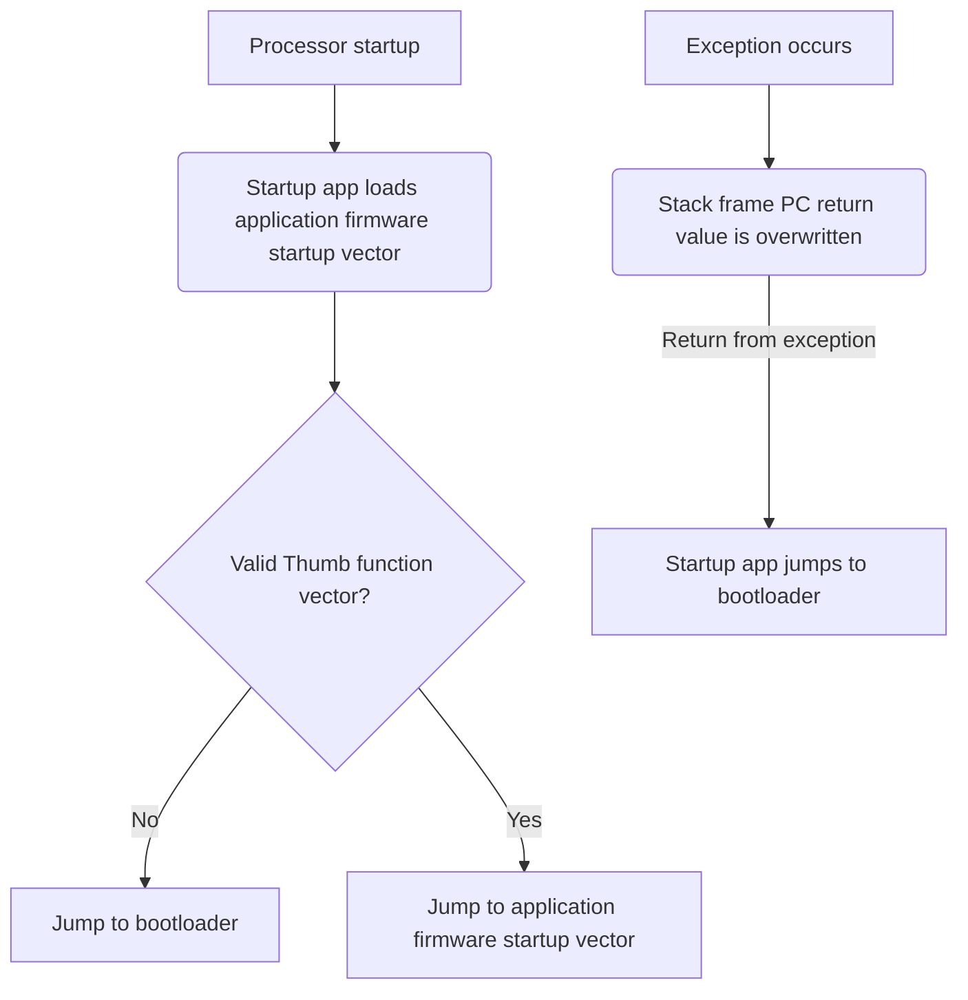

# MODULES STARTUP
The STM32 modules use the STM32 inbuilt bootloader which allows for firmware updates via USB through the DFU protocol. In the scenario that a module's power is removed while it is in the process of updating, there is a chance that the firmware loaded on the microcontroller will be invalid. In this scenario, there is no way for the module to reach the bootloader again, and thus it will be "bricked" forever, unable to ever boot back to the bootloader.

The code in this folder is intended to provide a failsafe system to prevent this scenario. The first sector of memory in the micocontroller is occupied by the startup assembly file. The startup application will start the application firmware as long as it appears valid.

The firmware image is expected to be linked to start 32K into the flash region, at address 0x08008000. The layout must be as follows:
- 0x08008000 - Vector table at 
- 0x08008200 - Integrity Info table
- 0x08008400 - Actual application

The Integrity Info Table contains information required by the startup module to confirm that the application firmware is correct:
| Length (bytes)  | Description |
| ------------- | ------------- |
| 4  | Firmware CRC (calculated with CRC32 Ethernet polynomial, initial value 0xFFFFFFFF)  |
| 4  | Firmware length in bytes, counting from 0x08008400  |
| 4  | Address where firmware length counting begins. Should always be 0x08008400 |
| N/A | Null-terminated string containing the name of the module this firmware is for. |

In this way, a failed firmware update will not result in a permanently bricked system.
