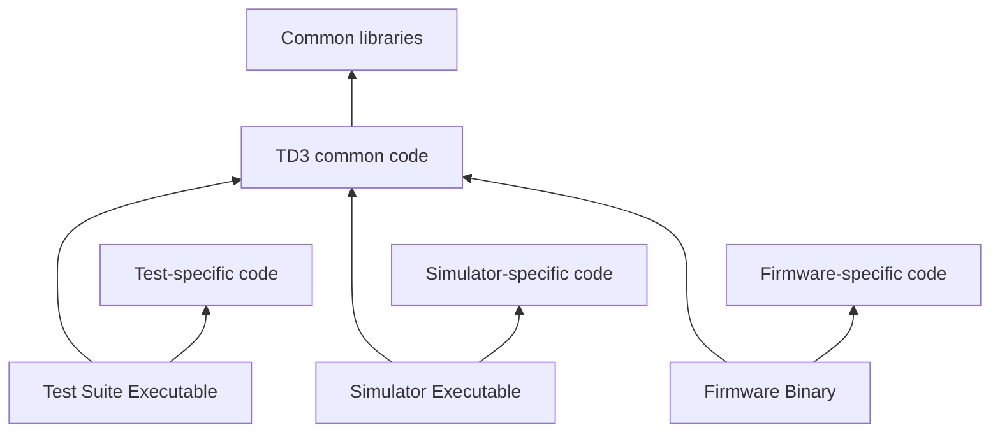

# Temperature Deck Generation 3 Firmware

This directory has the code for the Temperature Deck Gen3 (TD3)

## Basic project structure

The code for this module consists of a core set of code that can be compiled for any target platform, as well as supporting code that implements the lower levels of control for each specific platform. With this structure, the code can be compiled for three primary targets:

- __firmware__ - the actual firmware running on the microcontroller
- __tests__ - code that is intended to work alongside a suite of unit tests
- __simulator__ - a version of the firmware that runs on the host platform (whatever computer is used to compile it), and which simulates the low level behavior of the firmware.

The structure of each target is shown below (arrows indicate dependencies):

The __firmware__ subfolder contains more detailed documentation of the architecture of the firmware.

## Relevant build system targets

### Cross-build
When cross-compiling the firmware (using the `stm32-cross` cmake preset, running `cmake --build ./build-stm32-cross`), you can
- Build the firmware: `cmake --build ./build-stm32-cross --target tempdeck-gen3`
- Build the firmware, connect to a debugger, and upload it: `cmake --build ./build-stm32-cross --target tempdeck-gen3-debug`
- Lint the firmware: `cmake --build ./build-stm32-cross --target tempdeck-gen3-lint`
- Format the firmware: `cmake --build ./build-stm32-cross --target tempdeck-gen3-format`
- Flash the firmware to a board: `cmake --build ./build-stm32-cross --target tempdeck-gen3-flash`
- Build a .hex file suitable for use with stm's programmer: `cmake --build ./build-stm32-cross --target tempdeck-gen3-hex`
- Build a .bin file suitable for some other programmers: `cmake --build ./build-stm32-cross --target tempdeck-gen3-bin`

### Debugging
There's a target called `tempdeck-gen3-debug` that will build the firmware and then spin up a gdb, spin up an openocd, and connect the two; load some useful python scripts; connect to an st-link that should be already plugged in; automatically upload the firmware, and drop you at a breakpoint at boot time. This should all download itself and be ready as soon as `cmake --preset=stm32-cross .` completes, with one exception: Gdb python support is incredibly weird and will somehow always find your python2 that the system has, no matter how hard you try to avoid this. The scripts should work fine, but you have to install setuptools so `pkg_resources` is available, since this isn't really something we want to "install" by downloading it to some random directory and dropping it in gdb's embedded python interpreter's package path, so do the lovely
