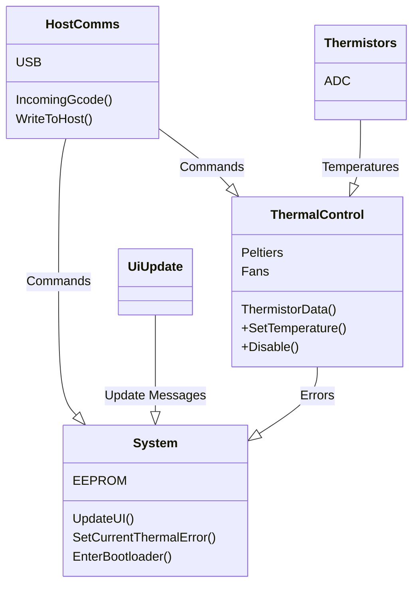

# Firmware Architecture

## Tasks
The functionality of the Temp Deck Firmware is split into a set of FreeRTOS tasks. Each task maintains its own stack, and the relative priority between tasks can be configured to reflect the importance of timing between the different system tasks.

### Task Descriptions
Each task on the system is either _periodic_, running at a fixed frequency; or it is _message driven_, running every time there is a new message available and sleeping otherwise. The tasks on the system are defined as follows:

- __Host Comms task__: _(message-driven)_ This task is responsible for parsing incoming USB data and parsing it into messages to dispatch to other tasks on the system, as well as receiving messages from other tasks to serialize into USB messages back to the host. See `./host_comms_task`
- __System Task__: _(message-driven)_ This task is responsible for miscellaneous system tasks with low timing requirements. These include updating the User Interface lights and managing the shutdown sequence before jumping to the bootloader. See `./system_task`
- __UI Update Task__: _(periodic)_ This task sends a message to the System Task at a fixed frequency in order to drive updates of the UI on the system. See `./ui_update_task`
- __Thermistor Task__: _(periodic)_ The thermistor task manages periodic reading of the thermistors on the system. At the end of each read, the data is sent to the Thermal Task. See `./thermistor_task`
- __Thermal Task__: _(message-driven)_ The thermal task controls the Peltiers 

### Task Architecture

The tasks on the system are organized in a hierarchial fashion. The class diagram below is used to show the relationships between tasks. An arrow from one task to another means that the first task sends messages to the second task. Responses may also be sent back, but tasks only send unsolicited messages in one direction.

- The drivers that each task contains are listed as member variables (e.g. `Peltiers`, `Fans`).
- The messages that a task receives are listed as functions (e.g. `UpdateUI()`). Messages for which an Acknowledge is sent are prefixed with a `+`.

## Message Passing
The 
