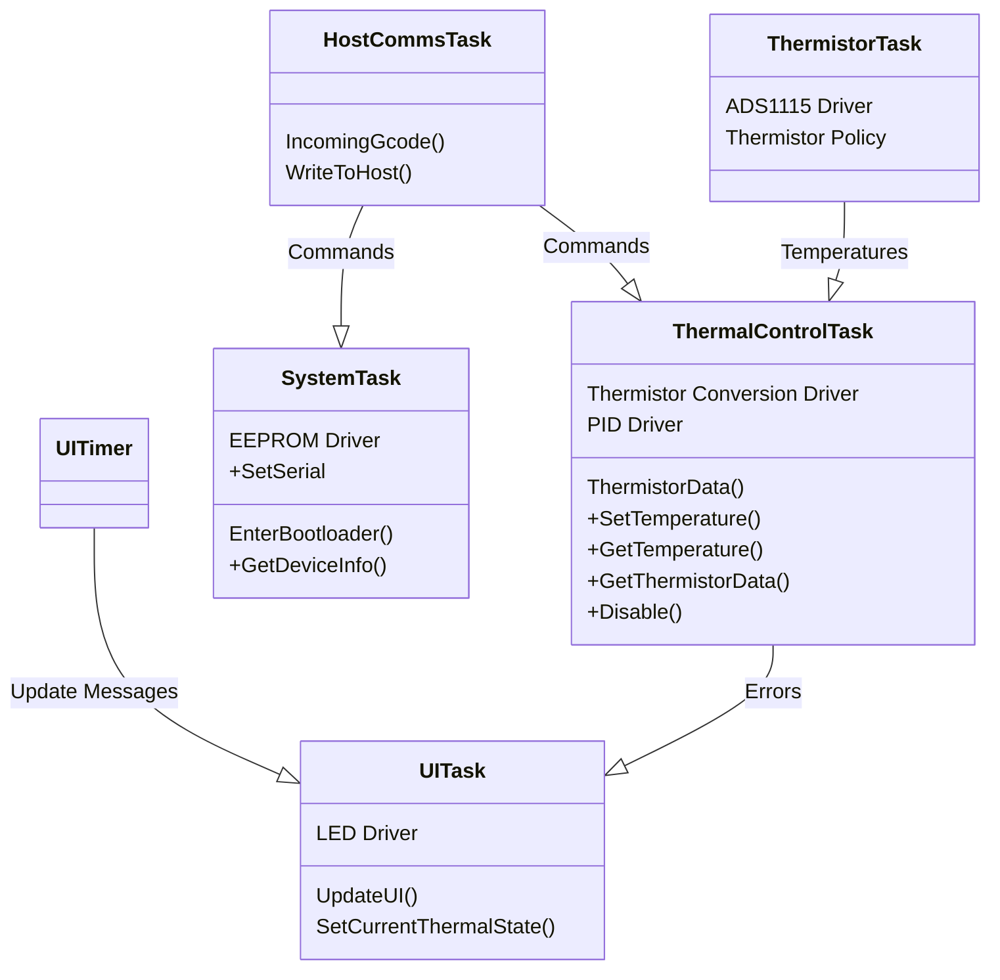

# Firmware Architecture

## Drivers
Hardware peripherals attached to the STM32 are classified into drivers. These drivers are not given their own tasks, but are rather utilized _by_ the software tasks. Lower level hardware control, such as simple access to internal peripherals, is covered by 'Hardware Policy' code. Drivers are distinct in that they maintain their own state.

- __EEPROM Driver__ - Provides functionality to read and write the EEPROM on teh system. See `../../include/common/core/at24c0xc.hpp`
- __LED Driver__ - Provides functionality to write to the LED's on the system. See `../../include/common/core/xt1511.hpp`
- __PID Driver__ - Provides a unified interface to calculate Proportional Integral Derivative control. See `../../include/common/core/pid.hpp`
- __ADS1115 Driver__ - Provides an interface to control the ADS1115 ADC IC on the main board. See `../../include/common/core/ads1115.hpp`
- __Thermistor Conversion Driver__ - Provides an interface to convert an ADC reading into a temperature in ºC.

## Hardware Policy
Hardware Policy drivers provide low-level access to peripherals that don't require their own state tracking. Additionally, when compiling for a host-side target (tests or simulator), the policy is what changes to allow the task & hardware drivers to simulate their functionality. The Task Descriptions below all contain a list of the functionalities implemented by the task's respective policy.

## Tasks
The functionality of the Temp Deck Firmware is split into a set of FreeRTOS tasks. Each task maintains its own stack, and the relative priority between tasks can be configured to reflect the importance of timing between the different system tasks.

### Task Descriptions
Each task on the system is either _periodic_, running at a fixed frequency; or it is _message driven_, running every time there is a new message available and sleeping otherwise. The tasks on the system are defined as follows:

- __Host Comms task__: _(message-driven)_ See `./host_comms_task/`. This task is responsible for parsing incoming USB data and parsing it into messages to dispatch to other tasks on the system, as well as receiving messages from other tasks to serialize into USB messages back to the host. Policy functionality:
- - Read from & write to onboard USB connection. See `./host_comms_task/`
- __System Task__: _(message-driven)_ See `./system_task`. This task is responsible for miscellaneous system tasks with low timing requirements. These include updating the User Interface lights and managing the shutdown sequence before jumping to the bootloader. Policy functionality includes:
- - Read from & write to internal flash for updating & reading the device serial number. 
- - Enter the DFU bootloader
- - Write or read an array of I2C bytes (thread-safe via semaphore) for the EEPROM driver
- __UI Task__: _(message-driven)_ See `./ui_task/`. This task is driven by a timer (__UI Timer__) to periodically update the LED's on the system based on the current thermal system state. Other tasks send their current state to the UI Task, which decides what to display based on the combined state of the main tasks. Policy functionality:
- - Write data to the LED's
- __Thermistor Task__: _(periodic)_ See `./thermistor_task/`. The thermistor task manages periodic reading of the thermistors on the system. At the end of each read, the data is sent to the Thermal Task. Policy functinonality includes:
- - Write or read a 16-byte I2C register (thread-safe via semaphore) for the ADS1115 driver
- - Sleep the task until a specific millisecond tick value
- __Thermal Control Task__: _(message-driven)_ The thermal task controls the Peltiers and Fans, as well as managing the high level control logic for the thermal elements. Policy functionality:
- - Enable or disable the peltiers
- - Set the direction and pulse width of the peltiers
- - Set the speed of the fans
- - Get the latest tachometer reading from the fans
- - Get the latest current reading from the peltiers

### Task Architecture

The tasks on the system are organized in a hierarchial fashion. The class diagram below is used to show the relationships between tasks. An arrow from one task to another means that the first task sends messages to the second task. Responses may also be sent back, but tasks only send unsolicited messages in one direction.

- The drivers that each task contains are listed as member variables (e.g. `Peltiers`, `Fans`).
- The messages that a task receives are listed as functions (e.g. `UpdateUI()`). Messages for which an Acknowledge is sent are prefixed with a `+`.

## Message Passing
The 
