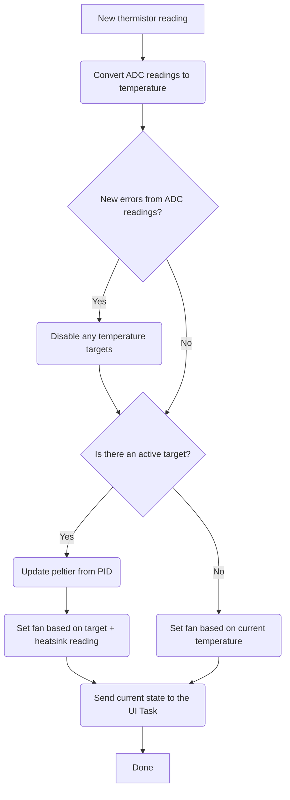

# Thermal Control Task
The thermal control task runs every time there is a new message. Messages include:
- ThermistorData which relays updated thermistor data to this task
- SetTemperature to set the target temperature of the peltiers
- GetTemperature to get the current temperature readings
- GetThermistorData to get the current raw ADC readings for the temperature
- Disable to turn off active control of the thermal system
- GetThermalOffsets to get the thermal offset values for this board
- UpdateThermalOffsets to update the value of the thermal offsets on this board.

## Thermal Control Logic
Whenever a ThermistorData message is received, the Thermal Control Task updates control of the peltiers and fans. Control follows logic as shown below:

### Fan Control
- When control is off, the fan is controlled to make sure the block temperature is not hot enough to potentially cause burns.
- When contrl is on, the fan is controlled to cool the block while the peltier is cooling, as well as during heating if the heatsink temperature rises to an unsafe level.

## Thermal Offsets
The thermal offset coefficients are saved on the EEPROM, which is managed by this task. The offset coefficients are __TBD!!!__
