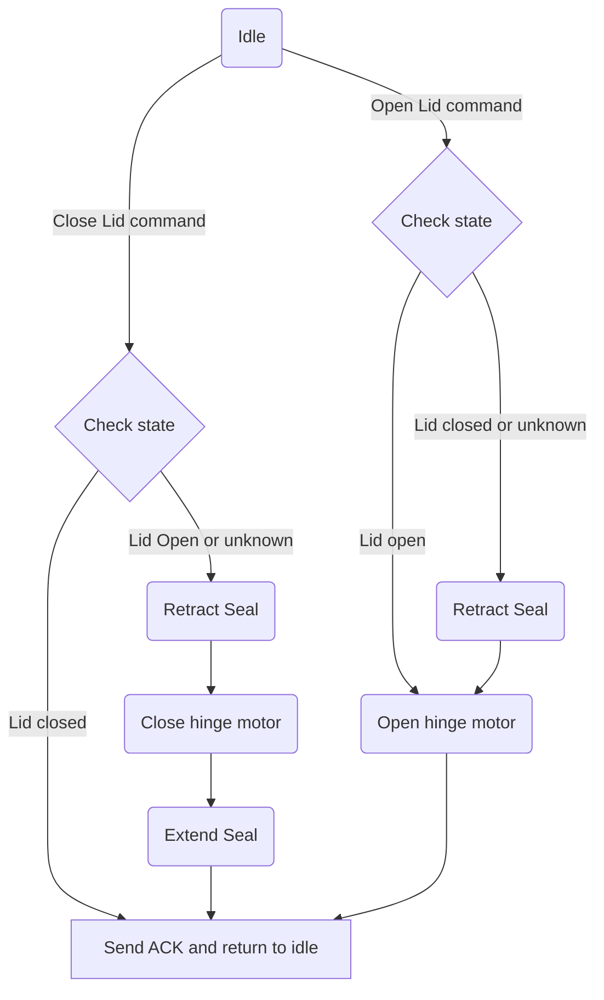
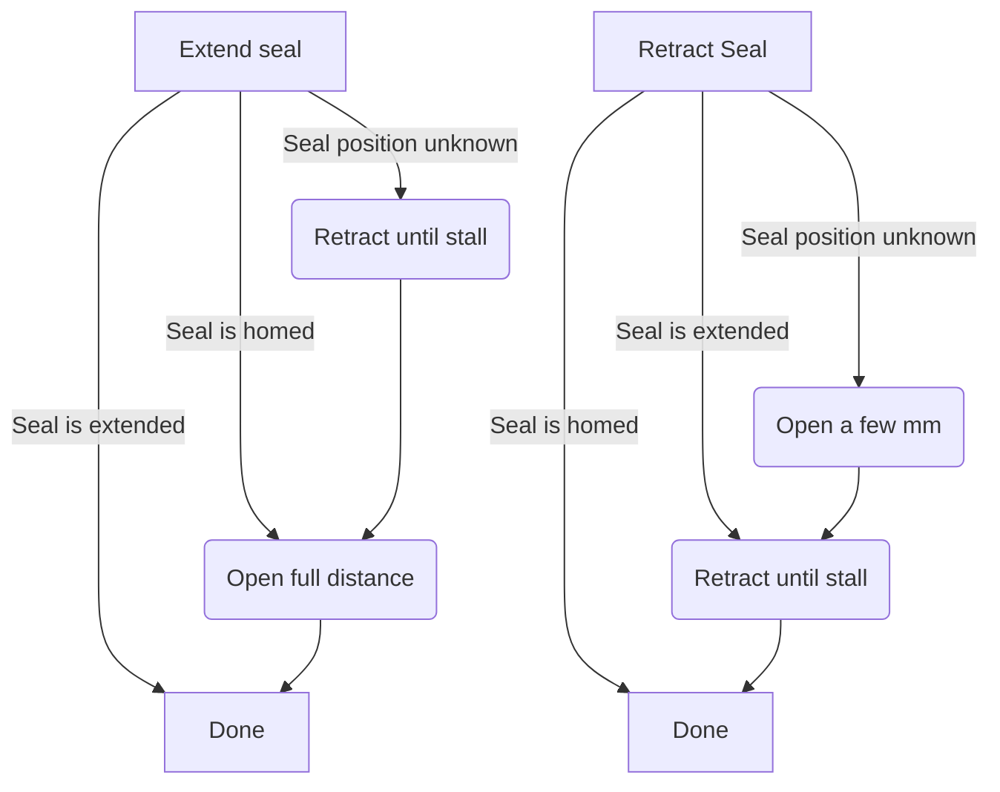
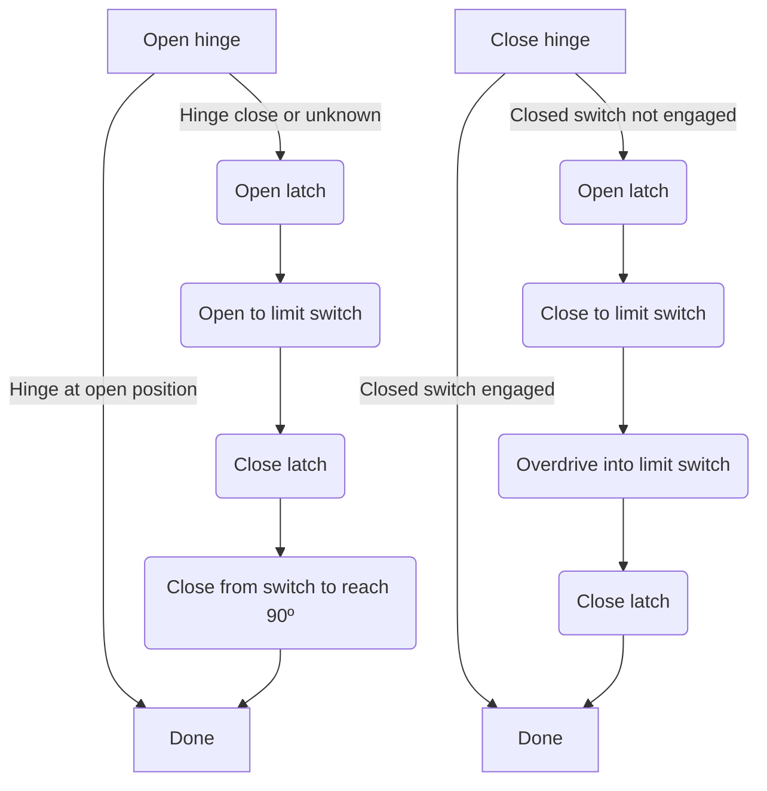

# Motor Task

## Lid state machines

### Overall state machine

```mermaid
graph TD
    A(Idle)
    C{Check state}
    D{Check state}
    F(Retract Seal)
    Falt(Retract Seal)
    G(Extend Seal)
    E[Send ACK and return to idle]
    H(Open hinge motor)
    I(Close hinge motor)


    A -->|Open Lid command| C
    A -->|Close Lid command| D
    C ---->|Lid open| H
    D ---->|Lid closed| E
    C -->|Lid closed or unknown| F
    D -->|Lid Open or unknown| Falt
    F --> H 
    Falt --> I
    I --> G 
    G --> E
    H ---> E
```

### Seal motor sub-state machine

```mermaid
graph TD
    Start1[Extend seal]
    OpenFull1(Open full distance)
    RetractFull1(Retract until stall)
    Done1[Done]
    
    Start1 ----->|Seal is extended| Done1
    Start1 ---->|Seal is homed| OpenFull1
    Start1 -->|Seal position unknown| RetractFull1
    RetractFull1 ---> OpenFull1
    OpenFull1 --> Done1

    Start2[Retract Seal]
    RetractFull2(Retract until stall)
    OpenSome2(Open a few mm)
    Done2[Done]

    Start2 -->|Seal position unknown| OpenSome2
    Start2 ---->|Seal is extended| RetractFull2
    Start2 -->|Seal is homed| Done2
    OpenSome2 --> RetractFull2
    RetractFull2 --> Done2
```

### Hinge motor sub-state machine

```mermaid
graph TD
    StartO[Open hinge]
    OpenToSwitch(Open to limit switch)
    BackTo90(Close from switch to reach 90º)
    DoneO[Done]
    StartC[Close hinge]
    CloseToSwitch(Close to limit switch)
    CloseOverdrive(Overdrive into limit switch)
    DoneC[Done]

    LatchO1(Open latch)
    LatchO2(Close latch)
    LatchC1(Open latch)
    LatchC2(Close latch)

    StartO -->|Hinge at open position| DoneO
    StartO -->|Hinge close or unknown| LatchO1 --> OpenToSwitch
    OpenToSwitch --> LatchO2 --> BackTo90 --> DoneO

    StartC -->|Closed switch engaged| DoneC
    StartC -->|Closed switch not engaged| LatchC1 --> CloseToSwitch
    CloseToSwitch --> CloseOverdrive --> LatchC2 --> DoneC
```
