# Motor Task

## Lid Control

### Overall state machine

The entire lid assembly (seal motor + lid hinge motor) is controlled through a central state machine, which then initiates actions through sub-state machines specific to each motor.

### Seal motor

Seal motor position is determined based off of two limit switches, one at the top of retraction and one at the bottom of extension.

On the current PCB revision (Rev 2), there is only one line enabled for the seal motor limit switch. Therefore, the seal motor state machine must make assumptions about which limit switch is being triggered. Additionally, whenever a limit switch is triggered, the seal must then back off of the limit switch so that it is not resting in a triggered position.

Limit switch detection is accomplished with a falling edge interrupt. Before a seal stepper motor movement, the limit switch may be "armed" by the motor task to mark that the next falling edge interrupt should result in a Seal Stepper Complete message. The interrupt is disarmed once it has been triggered once, and must be armed again before the next movement that needs to trigger a limit switch.

### Hinge motor sub-state machine

```mermaid
graph TD
    StartO[Open hinge]
    OpenToSwitch(Open to limit switch)
    OpenOverdrive(Overdrive into limit switch)
    DoneO[Done]
    StartC[Close hinge]
    CloseToSwitch(Close to limit switch)
    CloseOverdrive(Overdrive into limit switch)
    DoneC[Done]
    LiftStart[Plate Lift]
    LiftOpen(Open past 90º)
    LiftReturn(Close past limit switch)
    RunOpenHinge[Start Open Hinge action]

    LatchO1(Open latch)
    LatchO2(Close latch)
    LatchC1(Open latch)
    LatchC2(Close latch)

    StartO -->|Hinge at open position| DoneO
    StartO -->|Hinge close or unknown| LatchO1 --> OpenToSwitch
    OpenToSwitch --> LatchO2 --> OpenOverdrive --> DoneO

    StartC -->|Closed switch engaged| DoneC
    StartC -->|Closed switch not engaged| LatchC1 --> CloseToSwitch
    CloseToSwitch --> CloseOverdrive --> LatchC2 --> DoneC

    LiftStart --> LiftOpen --> LiftReturn --> RunOpenHinge
```

