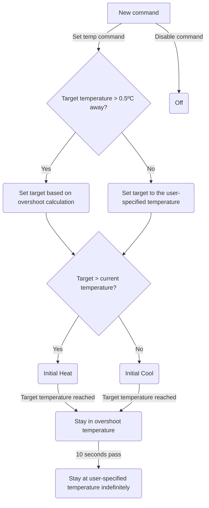

# Thermal Subsystem

The Thermocycler contains two primary thermal subassemblies, the _peltier plate_ and the _lid heater_.

## Peltier Plate

The plate consists of a 3 column array of peltier modules, where each column is individually controllable (referred to as the __left__, __right__, and __center__ regions). A total of six thermistors (one per peltier region) are mounted on the plate for thermal feedback.

### Plate Offset

The temperature measured by the thermistors is not necessarily equal to the temperature of the plate. In order to compensate for this temperature differential, a set of calibration coefficients are provided to make a more accurate estimate of the temperature in the wells.

- There are three offset coefficents, `A`, `B`, and `C`.
- There are two inputs to the calibration function: The current uncalibrated temperature of the thermistor (`T`), and the current temperature measured on the heat sink (`H`).
- The output is the Calibrated Temperature, `Tc`

The offset compensation is as follows: `Tc = (A * H) + ((B + 1) * T) + C`

Furthermore, there are separate B and C coefficients for each channel (L/C/R).

### Ramp Control & Volumetric Overshoot

When a new target temperature is set, the `plate_control` module enters a simple state machine. In order to ensure that the temperature of liquids in the plate is appropriate, the state machine includes __volumetric overshoot__ based on the maximum volume of liquid in a well (configured by the command to set the plate temperature).

## Lid Heater

The lid heater consists of a single resistive heating pad and a single thermistor for temperature feedback. The lid's primary purpose is to prevent condensation in the wells by providing a temperature above that of the peltier plate.

## Fans

### Control

The fans are controlled by a PWM channel on Timer 16

### Tachometer Feedback

The tachometers for the fans are monitored by Channels 1 and 2 on Timer 4. The input channels are configured for Input Capture monitoring on rising edges. Testing shows that the approximate low range of the fan velocity is ~50 RPM

- The timer is set to run at 10kHz and count to 2,000 (thus running for 0.2 seconds)
- When the timer starts, a DMA transaction is configured for each channel to move the first two Input Capture readings into buffers
- When the timer overflows, the difference between the two readings is saved into a variable for each channel. This gives the _period_ of the fan tachometer.
- - The interrupt also clears the buffers, in order to be able to detect an idle fan.
