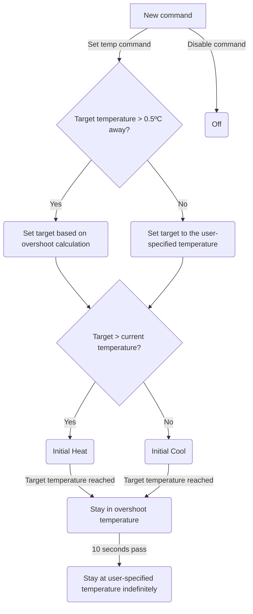

# Thermal Subsystem

The Thermocycler contains two primary thermal subassemblies, the _peltier plate_ and the _lid heater_.

## Peltier Plate

The plate consists of a 3 column array of peltier modules, where each column is individually controllable (referred to as the __left__, __right__, and __center__ regions). A total of six thermistors (one per peltier region) are mounted on the plate for thermal feedback.

### Plate Offset

The temperature measured by the thermistors is not necessarily equal to the temperature of the plate. In order to compensate for this temperature differential, a set of calibration coefficients can be programmed to set a function in the form of `y = mx + b`, wherein `x` is the temperature measured by a thermistor and `y` is the approximate temperature on the actual plate.

### Ramp Control & Volumetric Overshoot

When a new target temperature is set, the `plate_control` module enters a simple state machine. In order to ensure that the temperature of liquids in the plate is appropriate, the state machine includes __volumetric overshoot__ based on the maximum volume of liquid in a well (configured by the command to set the plate temperature).

## Lid Heater

The lid heater consists of a single resistive heating pad and a single thermistor for temperature feedback. The lid's primary purpose is to prevent condensation in the wells by providing a temperature above that of the peltier plate.
